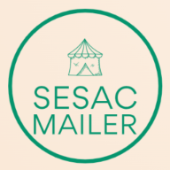

# 목차

- [사용방법](#사용방법)
- [프로젝트 소개](#프로젝트-소개)
- [사용된 기술 스택](#사용된-기술-스택)
  - [Front-End](#front-end)
  - [Back-End](#back-end)
- [구현한 기능 목록](#구현한-기능-목록)


<br/>

# 사용방법
- mail 폴더
	```bash
	$ git clone https://github.com/Harimad/mail.git
	```
	```bash
	$ cd src
	```
	```bash
	$ node jobkorea.js
	```
- 웹 사이트 방문 (https://harimad.github.io/mail/)
	```
  키워드, 이메일 작성
	```

- 이메일 확인하기

<br/>

# 프로젝트 소개

<div align="center">

<br>
<p>
  <b>청년취업사관학교 새싹(SeSAC) 기업연계형 프론트엔드 실무 프로젝트 과정 2기</b>에서
	<br/>
	1 주일간 진행된 개인 프로젝트 기간동안 만든 토이 프로젝트입니다.</p>
<p>주니어 프론트엔드 개발자를 목표로 하는 수강생들이 <b>잡코리아에서 신입/주니어를 채용하는 구인</b> 항목을 찾을 때<br> 도움을 주고자 개인 프로젝트를 진행하게 되었습니다.</p>
</div>

<br/>

# 사용된 기술 스택

## Front-End


## Back-End


<br/>

# 구현한 기능 목록

- bootstrap 으로 스타일 구현
- express로 서버 구현
- nodemailer 모듈로 이메일 전송
- nodecon으로 정기 메일 서비스
- 잡코리아 크롤링 (axios, cheerio)
